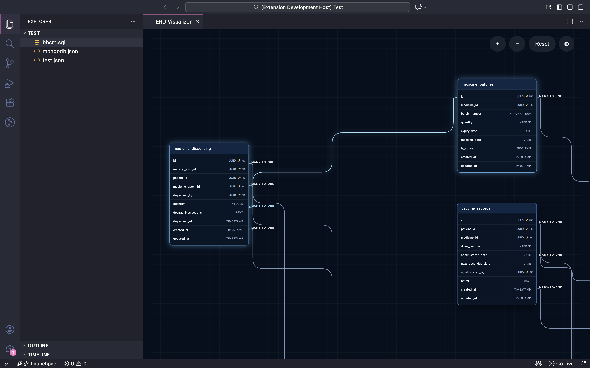

# ERD Visualizer for VS Code

> Parse SQL + JSON schemas and design ERDs without leaving the editor.

## Highlights

- Supports popular SQL DDL (PostgreSQL, MySQL, SQL Server, SQLite) plus canonical JSON schemas.
- Auto-detects entities, PK/FK relationships, and cardinality to keep diagrams readable.
- Interactive dark-mode canvas with pan/zoom/drag and per-file layout persistence.
- Export diagrams as SVG/PNG or copy snapshots straight into docs and pull requests.

Launch the visualizer from the Command Palette (`ERD: Visualize current schema`) or the editor toolbar icon whenever a `.sql` or `.json` file is active.

---

## Release Notes

### 0.1.0 (Preview)

- Command palette + editor-title icon to launch the ERD visualizer.
- JSON + SQL parsing pipeline with normalization into `SchemaModel`.
- Interactive SVG canvas with pan/zoom/drag, layout persistence, PK/FK glyphs, cardinality badges.
- Export popover (SVG/PNG, background selector, resolution scaling).

See `openspec/changes/` for detailed proposals and upcoming iterations.

---

## Support & Feedback

- **Issues / Feature Requests**: [open an issue](https://github.com/Dukeabaddon/ERD-Visualizer/issues).
- **Specs & design decisions**: tracked in `openspec/project.md` and related change folders.
- **Community**: contributions welcome—fork, branch off `feat/<topic>`, and submit PRs following OpenSpec tasks.

---

© 2025 Aaron Mecate — Released under the [MIT License](./LICENSE).

