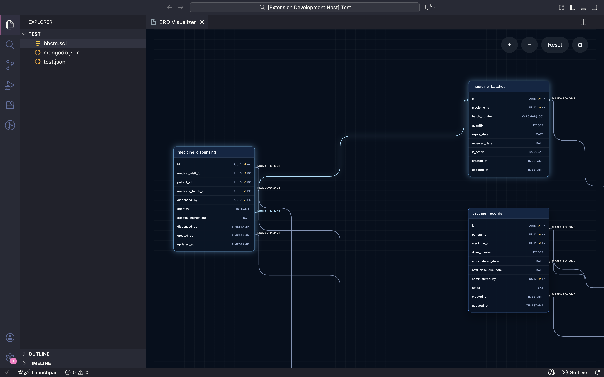

<div align="center">

<p>
  
</p>

### **Design, inspect, and export ERDs without leaving VS Code.**

**ERD Visualizer** — parse SQL DDL or JSON schemas into an interactive entity-relationship diagram. Auto-detect tables, PK/FK links, and cardinality; pan/zoom/drag the canvas; export PNG / JPG / PDF for docs and PRs.

| Problem | With ERD Visualizer |
|---------|---------------------|
| Schema buried in `.sql` / `.json` files | One-click diagram from the active editor |
| Dialect chaos (Postgres, MySQL, SQLite, SQL Server, Spark) | AST + legacy fallback parsers |
| Diagrams that die in slides | Export PNG / JPG / PDF from the canvas |
| Layout resets every open | Per-file layout persistence in the workspace |

</div>

<p align="center">
  <a href="https://marketplace.visualstudio.com/items?itemName=dukeabaddon.erd-visualizer"></a>&nbsp;
  <a href="https://marketplace.visualstudio.com/items?itemName=dukeabaddon.erd-visualizer"></a>&nbsp;
  <a href="https://marketplace.visualstudio.com/items?itemName=dukeabaddon.erd-visualizer"></a>&nbsp;
  <a href="https://github.com/Dukeabaddon/ERD-Visualizer/stargazers"></a>&nbsp;
  <a href="https://github.com/Dukeabaddon/ERD-Visualizer/actions/workflows/ci.yml"></a>&nbsp;
  <a href="LICENSE"></a>
</p>

<p align="center">
  <a href="https://marketplace.visualstudio.com/items?itemName=dukeabaddon.erd-visualizer"><strong>Install</strong></a> ·
  <a href="#get-started">Get started</a> ·
  <a href="#supported-inputs">Inputs</a> ·
  <a href="#features">Features</a> ·
  <a href="#demo">Demo</a> ·
  <a href="#privacy--security">Privacy</a> ·
  <a href="#changelog">Changelog</a>
</p>

---

> **Local-only.** Your schema is parsed inside VS Code. Nothing is uploaded.

<p align="center"><strong>See it in action:</strong></p>

<p align="center">
  
</p>

<p align="center">
  
</p>

## Why developers use ERD Visualizer

- **Stay in the editor** — Command Palette or toolbar icon on `.sql` / `.json`
- **Multi-dialect SQL** — PostgreSQL, MySQL, SQLite, SQL Server (AST) + Databricks/Spark heuristics
- **JSON schemas** — canonical `entities` / `relationships`, plus alternate `attributes` shapes
- **Readable diagrams** — PK glyphs, FK edges, cardinality, dark canvas
- **Export-ready** — PNG, JPG, PDF with background and scale controls

---

<a id="get-started"></a>

## Get started

1. Install **[ERD Visualizer](https://marketplace.visualstudio.com/items?itemName=dukeabaddon.erd-visualizer)** (`dukeabaddon.erd-visualizer`)
2. Open a `.sql` or `.json` schema file
3. Run **`ERD: Visualize current schema`** (or click the editor title icon)

Also available: **`ERD: Visualize current editor`** and **`ERD: Visualize schema from file`**.

Requires **VS Code ≥ 1.85.0**.

---

<a id="supported-inputs"></a>

## Supported inputs

### SQL

| Dialect | Path | Notes |
|---------|------|-------|
| PostgreSQL | AST (`node-sql-parser`) | `CREATE TABLE` / `VIEW`, `ALTER`, `COMMENT ON` |
| MySQL | AST | Backticks, common DDL |
| SQLite | AST | `IF NOT EXISTS`, inline `REFERENCES` |
| SQL Server (mssql) | AST | Best-effort |
| Databricks / Spark | Legacy heuristics | `USING DELTA`, `ARRAY<>` / `MAP<>` / `STRUCT<>` |

Accepted constructs (best-effort): `CREATE TABLE`, table/column PK & FK, inline `REFERENCES`, `ALTER TABLE … ADD FOREIGN KEY`, nested `CHECK` / `DEFAULT`, composite PKs.

**Not a full SQL engine.** DML-only files (`SELECT` / dumps without DDL) yield an empty diagram. Unsupported syntax falls through dialects → legacy regex → empty model (no crash).

### JSON

**Canonical**

```json
{
  "entities": [
    { "name": "users", "columns": [{ "name": "id", "primary": true }, { "name": "email" }] },
    { "name": "orders", "columns": [{ "name": "id", "primary": true }, { "name": "user_id" }] }
  ],
  "relationships": [
    { "from": "orders.user_id", "to": "users.id", "cardinality": "many-to-one" }
  ]
}
```

**Alternate (normalized)** — `attributes[]`, `primaryKey` (string or array), per-entity `relationships` (`manyToOne` / `manyToMany`).

Strictness: Zod validates the canonical shape; unknown keys are ignored. Invalid JSON that merely *looks* like `{…}` falls through to SQL without throwing. UTF-8 BOM + leading whitespace are stripped before parse.

---

<a id="features"></a>

## Features

| Feature | Detail |
|---------|--------|
| Interactive canvas | Pan, zoom, drag entities |
| Layout persistence | Per-file positions in workspace state |
| Export | PNG / JPG / PDF (bg + scale) |
| Source jump | Click a column to reveal in the editor (best-effort) |
| Themes | System / light / dark |

---

<a id="demo"></a>

## Demo

```sql
CREATE TABLE users (
  id serial PRIMARY KEY,
  email varchar(255) NOT NULL
);

CREATE TABLE orders (
  id serial PRIMARY KEY,
  user_id integer,
  FOREIGN KEY (user_id) REFERENCES users(id)
);
```

Save as `schema.sql` → **ERD: Visualize current schema**.

---

## By the numbers

- Extension id: **`dukeabaddon.erd-visualizer`**
- Current package version: **0.1.3**
- Engines: **VS Code ^1.85.0**
- License: **MIT** · local parsing only

---

## Development

```bash
pnpm install
pnpm run compile
pnpm test              # parser adversarial suite
pnpm run test:contrib  # package.json icon / menu checks
```

Press **F5** in VS Code to launch an Extension Development Host.

CI: compile → `pnpm test` → `test:contrib` on push/PR to `main`.

---

## Privacy & security

- **No telemetry** from this extension
- Schemas are parsed **locally** in the VS Code process / webview
- File access is limited to what you open or pick via the file dialog

---

## Uninstall

VS Code → Extensions → **ERD Visualizer** → Uninstall.  
Layout keys under `erd.layout:*` live in workspace state and go away with the workspace storage.

---

## Star History

<a href="https://star-history.com/#Dukeabaddon/ERD-Visualizer&Date">
  <picture>
    <source media="(prefers-color-scheme: dark)" srcset="https://api.star-history.com/svg?repos=Dukeabaddon/ERD-Visualizer&type=Date&theme=dark" />
    <source media="(prefers-color-scheme: light)" srcset="https://api.star-history.com/svg?repos=Dukeabaddon/ERD-Visualizer&type=Date" />
    
  </picture>
</a>

---

<a id="changelog"></a>

## Changelog

### 0.1.3

- Adversarial Jest suite for SQL dialects + JSON shapes (CI now runs real parser tests)
- Fix UTF-8 BOM / leading whitespace before JSON detection
- Fix alternate JSON `attributes` objects and `primaryKey` arrays
- Valid non-schema JSON (`{}` / `[]`) returns an empty model instead of SQL fallback
- README refreshed (Marketplace installs badge = **total** via vsmarketplacebadges)
- Added README banner + logo assets (`assets/erd-visualizer-banner.png`, `assets/erd-visualizer-logo.png`); refreshed marketplace `icon.png`

### 0.1.2 / 0.1.1

- Nested parentheses in SQL (`CHECK`, `DEFAULT` functions)
- VS Code engine floor `1.85.0`
- Databricks/Spark SQL heuristics (`USING DELTA`, `ARRAY` / `MAP`)

### 0.1.0 (Preview)

- Command palette + editor-title icon
- JSON + SQL → `SchemaModel`
- Interactive canvas + export popover

---

## Contributing

Issues: https://github.com/Dukeabaddon/ERD-Visualizer/issues  
PRs welcome — run `pnpm test` and `pnpm run test:contrib` before opening.

## License

MIT — see [LICENSE](LICENSE).

---

<p align="center">
  <a href="https://marketplace.visualstudio.com/items?itemName=dukeabaddon.erd-visualizer">Marketplace</a> ·
  <a href="https://github.com/Dukeabaddon/ERD-Visualizer">GitHub</a>
</p>

<p align="center"><sub>© Aaron Mecate — MIT</sub></p>
